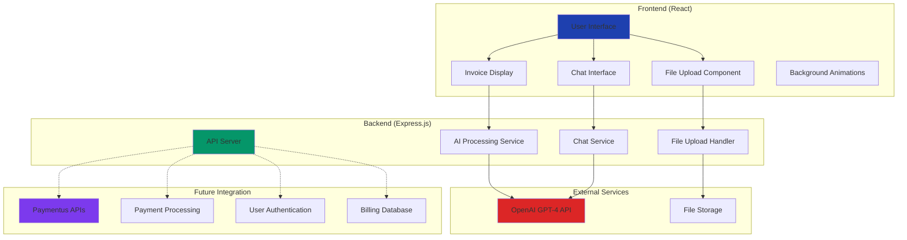
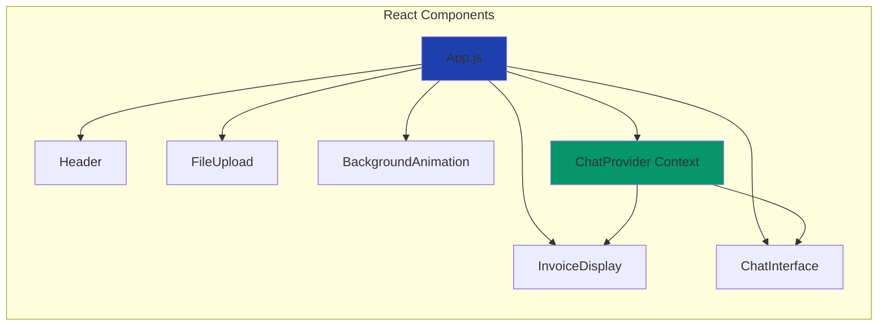
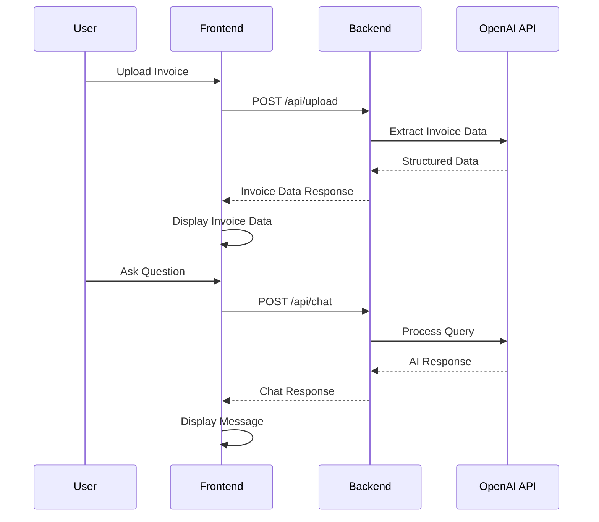
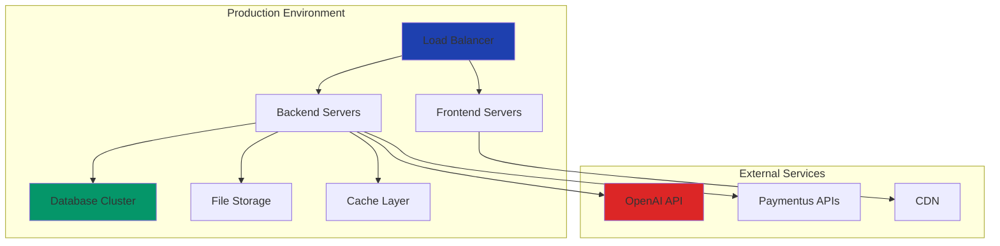

# 🏗️ System Architecture

## High-Level Architecture

## Component Architecture

## Data Flow

## Technology Stack

### Frontend Technologies
- **React 18**: Component-based UI framework
- **Tailwind CSS**: Utility-first CSS framework
- **Framer Motion**: Animation library
- **Axios**: HTTP client
- **React Icons**: Icon library

### Backend Technologies
- **Express.js**: Web application framework
- **Multer**: File upload middleware
- **CORS**: Cross-origin resource sharing
- **dotenv**: Environment variable management

### AI & Processing
- **OpenAI GPT-4**: Advanced language model
- **Custom Prompts**: Specialized for invoice extraction
- **Context Management**: Conversation state handling

## Security Considerations

### Current Implementation
- Environment variable protection for API keys
- File type validation for uploads
- CORS configuration for cross-origin requests
- Input sanitization for chat messages

### Production Recommendations
- JWT authentication integration
- Rate limiting for API endpoints
- File size and type restrictions
- Data encryption at rest and in transit
- Audit logging for compliance

## Scalability Design

### Horizontal Scaling
- Stateless backend design
- Session management via external store
- Load balancer ready architecture
- Microservices preparation

### Performance Optimization
- Component lazy loading
- Image optimization
- API response caching
- Database query optimization (future)

## Integration Points

### Paymentus System Integration
1. **Authentication**: SSO with existing user accounts
2. **Data Sync**: Real-time billing data synchronization
3. **Payment Flow**: Direct integration with payment processing
4. **Notifications**: Real-time updates and alerts
5. **Reporting**: Integration with existing analytics

### API Endpoints for Integration
- `GET /api/health` - System health check
- `POST /api/auth/validate` - Token validation
- `GET /api/user/:id/invoices` - User invoice history
- `POST /api/payment/process` - Payment processing
- `GET /api/analytics/dashboard` - Usage analytics

## Deployment Architecture

## Monitoring & Observability

### Metrics to Track
- API response times
- Invoice processing success rates
- User engagement metrics
- Error rates and types
- System resource utilization

### Logging Strategy
- Structured logging with correlation IDs
- Error tracking and alerting
- Performance monitoring
- User activity logging
- Security event logging

## Future Enhancements

### Phase 1: Core Integration
- Paymentus API integration
- User authentication system
- Payment processing workflow

### Phase 2: Advanced Features
- Multi-language support
- Batch invoice processing
- Advanced analytics dashboard

### Phase 3: Mobile & Voice
- React Native mobile app
- Voice interface integration
- Offline capability

---
*Architecture designed for scalability, security, and seamless integration*
