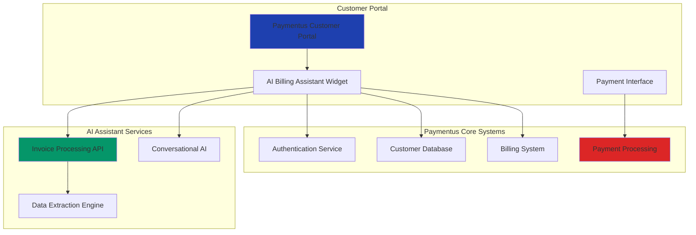
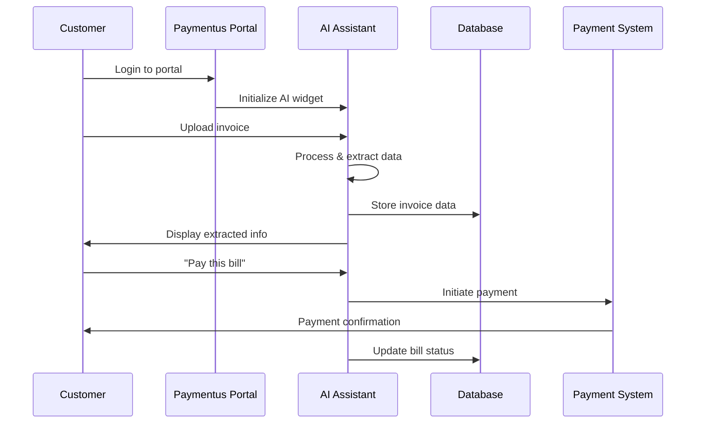
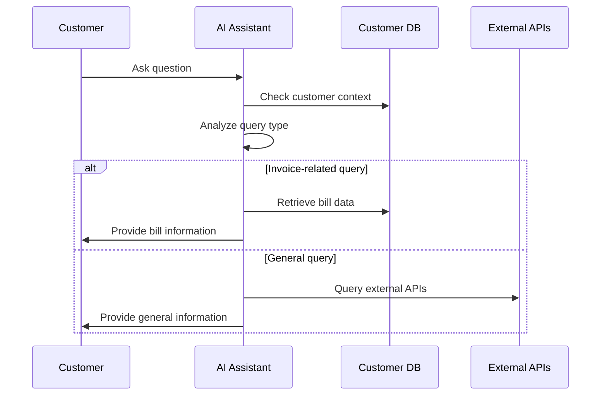

# 🔗 Paymentus Integration Guide

## Overview
This guide outlines how the Agentic AI Billing Assistant can be seamlessly integrated with existing Paymentus systems to enhance customer experience and streamline billing operations.

## Integration Architecture



## Integration Points

### 1. Authentication & User Management

#### Single Sign-On (SSO) Integration
```javascript
// Example SSO integration
const authenticateUser = async (paymentusToken) => {
  const response = await fetch('/api/auth/paymentus', {
    method: 'POST',
    headers: {
      'Content-Type': 'application/json',
      'Authorization': `Bearer ${paymentusToken}`
    },
    body: JSON.stringify({
      action: 'validate_token'
    })
  });
  
  return response.json();
};
```

#### User Context Synchronization
- Automatic user identification from Paymentus session
- Access to customer billing history
- Personalized AI responses based on account data
- Seamless transition between systems

### 2. Billing Data Integration

#### Real-time Bill Synchronization
```javascript
// Sync customer bills from Paymentus
const syncCustomerBills = async (customerId) => {
  const bills = await paymentusAPI.getCustomerBills(customerId);
  
  // Process and store in AI assistant context
  await aiAssistant.updateCustomerContext(customerId, {
    bills: bills,
    paymentHistory: await paymentusAPI.getPaymentHistory(customerId),
    preferences: await paymentusAPI.getCustomerPreferences(customerId)
  });
};
```

#### Automatic Invoice Processing
- New bills automatically processed by AI
- Key information extracted and indexed
- Proactive notifications for due dates
- Smart categorization and tagging

### 3. Payment Processing Integration

#### Direct Payment Flow
```javascript
// Initiate payment from AI assistant
const initiatePayment = async (invoiceId, amount, paymentMethod) => {
  const paymentRequest = {
    customerId: getCurrentCustomerId(),
    invoiceId: invoiceId,
    amount: amount,
    paymentMethod: paymentMethod,
    source: 'ai_assistant'
  };
  
  return await paymentusAPI.processPayment(paymentRequest);
};
```

#### Payment Status Updates
- Real-time payment confirmations
- Automatic bill status updates
- Payment history integration
- Receipt generation and delivery

### 4. Customer Support Integration

#### Intelligent Query Routing
```javascript
// Route complex queries to human agents
const routeQuery = async (query, context) => {
  const complexity = await aiAssistant.analyzeQueryComplexity(query);
  
  if (complexity.requiresHuman) {
    return await paymentusSupport.createTicket({
      query: query,
      context: context,
      priority: complexity.priority,
      category: complexity.category
    });
  }
  
  return await aiAssistant.processQuery(query, context);
};
```

## Implementation Phases

### Phase 1: Basic Integration (Weeks 1-2)
- [ ] SSO authentication setup
- [ ] Basic API endpoints integration
- [ ] Customer data synchronization
- [ ] Simple invoice upload and processing

### Phase 2: Enhanced Features (Weeks 3-4)
- [ ] Real-time bill synchronization
- [ ] Payment processing integration
- [ ] Advanced AI query capabilities
- [ ] Mobile responsiveness optimization

### Phase 3: Advanced Analytics (Weeks 5-6)
- [ ] Usage analytics and reporting
- [ ] Customer behavior insights
- [ ] Performance monitoring
- [ ] A/B testing framework

### Phase 4: Scale & Optimize (Weeks 7-8)
- [ ] Load balancing and scaling
- [ ] Advanced security features
- [ ] Multi-language support
- [ ] Voice interface integration

## Technical Requirements

### Infrastructure
- **Hosting**: Cloud-native deployment (AWS/Azure/GCP)
- **Database**: PostgreSQL for customer data, Redis for caching
- **API Gateway**: Rate limiting and request routing
- **Load Balancer**: High availability and performance
- **CDN**: Global content delivery for assets

### Security
- **Encryption**: TLS 1.3 for data in transit, AES-256 for data at rest
- **Authentication**: OAuth 2.0 + JWT tokens
- **Authorization**: Role-based access control (RBAC)
- **Compliance**: PCI DSS, SOC 2, GDPR compliance
- **Monitoring**: Real-time security event monitoring

### Performance
- **Response Time**: < 2 seconds for AI queries
- **Uptime**: 99.9% availability SLA
- **Scalability**: Auto-scaling based on demand
- **Caching**: Intelligent caching for frequent queries

## API Integration Examples

### Customer Bill Retrieval
```javascript
// Get customer bills from Paymentus
const getCustomerBills = async (customerId) => {
  const response = await fetch(`/api/paymentus/customers/${customerId}/bills`, {
    headers: {
      'Authorization': `Bearer ${paymentusApiKey}`,
      'Content-Type': 'application/json'
    }
  });
  
  return response.json();
};
```

### Payment Processing
```javascript
// Process payment through Paymentus
const processPayment = async (paymentData) => {
  const response = await fetch('/api/paymentus/payments', {
    method: 'POST',
    headers: {
      'Authorization': `Bearer ${paymentusApiKey}`,
      'Content-Type': 'application/json'
    },
    body: JSON.stringify({
      customerId: paymentData.customerId,
      amount: paymentData.amount,
      paymentMethod: paymentData.paymentMethod,
      billId: paymentData.billId
    })
  });
  
  return response.json();
};
```

### Webhook Integration
```javascript
// Handle Paymentus webhooks
app.post('/webhooks/paymentus', (req, res) => {
  const event = req.body;
  
  switch (event.type) {
    case 'bill.created':
      handleNewBill(event.data);
      break;
    case 'payment.completed':
      handlePaymentCompleted(event.data);
      break;
    case 'customer.updated':
      handleCustomerUpdate(event.data);
      break;
  }
  
  res.status(200).send('OK');
});
```

## Data Flow Diagrams

### Invoice Processing Flow


### Customer Query Flow


## Deployment Strategy

### Environment Setup
1. **Development**: Local development with mock Paymentus APIs
2. **Staging**: Full integration testing with Paymentus sandbox
3. **Production**: Live deployment with monitoring and rollback capability

### Rollout Plan
1. **Pilot Program**: Limited customer group (1-2 weeks)
2. **Gradual Rollout**: 25% → 50% → 75% → 100% (4 weeks)
3. **Full Deployment**: Complete customer base access
4. **Optimization**: Performance tuning and feature enhancement

### Monitoring & Analytics
- Real-time performance monitoring
- Customer usage analytics
- Error tracking and alerting
- Business impact measurement

## Success Metrics

### Technical KPIs
- API response time < 2 seconds
- 99.9% uptime
- Zero security incidents
- < 1% error rate

### Business KPIs
- 30% reduction in support tickets
- 25% increase in customer satisfaction
- 20% improvement in payment completion rates
- 15% reduction in payment processing time

### User Experience KPIs
- 90% user adoption rate
- 4.5+ star rating
- 80% query resolution rate
- 60% reduction in time to find information

---
*This integration guide ensures seamless deployment while maximizing value for both Paymentus and their customers.*
